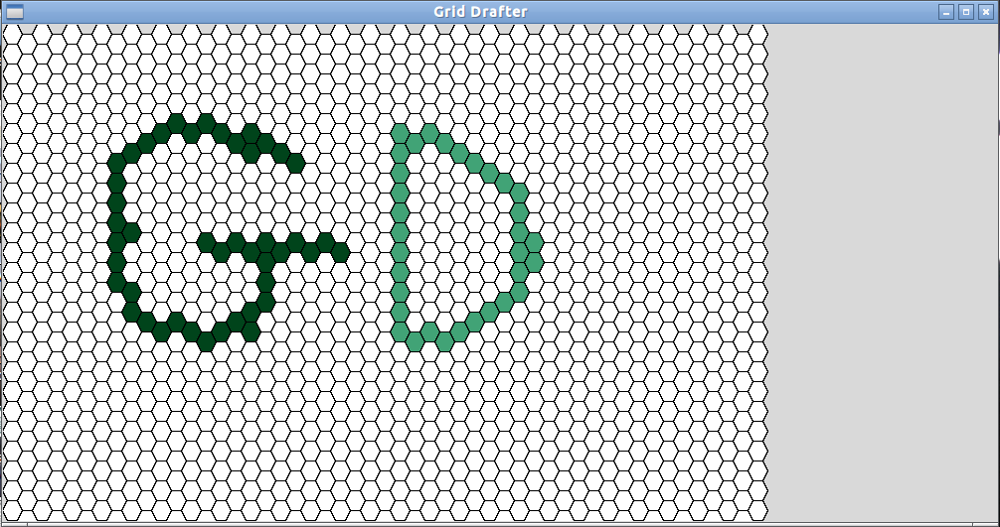

grid_drafter
============

This program is used to draw and manage two-dimensional integer elevation grids.

It can handle both square and hexagonal grids.

When the program is first run, it will display a blank screen with a grid on it.

Pressing keys 0-8 will then allow you to fill the grid cells in with a colour which corresponds to that key.

Pressing "S" will save the grid file in a format which can be read back in by the program for further editing. The colours drawn previously will be saved as integer numbers.

I use this program for creating and editing small digital elevation models for testing with hydrologic algorithms.

